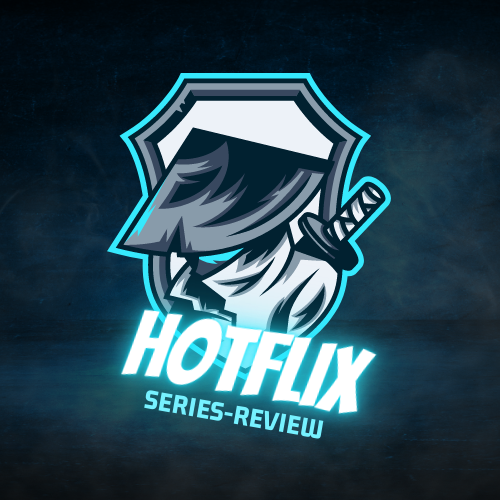

<a name="readme-top"></a>

<div align="center">

 <!-- LOGO -->

  
  <br/>

<!-- MAIN HEADING -->

  <h3><b>Series Review Portal</b></h3>

</div>

<!-- TABLE OF CONTENTS -->
# 📗 Table of Contents

- [📖 About the Project](#about-project)
  - [🛠 Built With](#built-with)
    - [Tech Stack](#tech-stack)
    - [Key Features](#key-features)
- [🚀 Live Demo](#live-demo)
- [💻 Getting Started](#getting-started)
  - [Setup](#setup)
  - [Prerequisites](#prerequisites)
  - [Install](#install)
  - [Usage](#usage)
  - [Run tests](#run-tests)
  - [Deployment](#deployment)
- [👥 Authors](#authors)
- [🔭 Future Features](#future-features)
- [🤝 Contributing](#contributing)
- [⭐️ Show your support](#support)
- [🙏 Acknowledgements](#acknowledgements)
- [❓ FAQ (OPTIONAL)](#faq)
- [📝 License](#license)

<!-- INTRO -->
# 📖 Series Review Portal <a name="about-project"></a>

> This is a Series Review Portal project for Movies and Series reviews.

## 🛠 Built With <a name="built-with"></a>
1. HTML
2. CSS
3. JavaScript
4. Webpack
### Tech Stack <a name="tech-stack"></a>

> Tech Stack to be updated soon

<details>
  <summary>Client</summary>
  <ul>
    <li><a href="https://reactjs.org/">HTML</a></li>
    <li><a href="https://reactjs.org/">CSS</a></li>
    <li><a href="https://reactjs.org/">JavaScript</a></li>
    <li><a href="https://reactjs.org/">Webpack</a></li>
  </ul>
</details>
<!-- Features -->

### Key Features <a name="key-features"></a>

> - View featured series
> - Like your favourite series
> - Comment on your favourite series

<p align="right">(<a href="#readme-top">back to top</a>)</p>

<!-- LIVE DEMO -->

LIVE DEMO

> Visit the [Live](https://anyars-encarta.github.io/Series-Review-Portal/dist/) page of the Project.
> Click this [link](https://drive.google.com/file/d/1DxSXsJfWHYL5gSP5Ph1Yg1qoA2o2eX9v/view?usp=sharing) to watch a short on the features of the project.

<p align="right">(<a href="#readme-top">back to top</a>)</p>

<!-- GETTING STARTED -->

## 💻 Getting Started <a name="getting-started"></a>

> To get a local copy up and running, follow these steps.

<!-- SETUP -->
### Setup

To setup this project, run this command:

```npm test
```
### Prerequisites

1. A Browser (Preferably Google Chrome)
2. A Code Editor
3. Internet Connection
4. Git

<!-- INSTALL -->
### Install

Install this project with Iroko.

### Usage

To run the project, execute the following command:

### Run tests
> npm test
### Deployment

You can deploy this project using:
>1.  GitHub Pages

<p align="right">(<a href="#readme-top">back to top</a>)</p>

<!-- AUTHORS -->
## 👥 Authors <a name="authors"></a>

> Mention all of the collaborators of this project.

👤 **Anyars Yussif**

- GitHub: [@anyars-encarta](https://github.com/anyars-encarta)
- Twitter: [@anyarsencarta](https://twitter.com/anyarsencarta)
- LinkedIn: [Anyars Yussif](https://www.linkedin.com/in/anyars-yussif-1a179769/)

👤 **Eugene Oduor Omwomo**

- GitHub: [@Omwomo](https://github.com/Omwomo)
- Twitter: [@Omwomo](https://twitter.com/username)
- LinkedIn: [Omwomo](https://www.linkedin.com/in/username/)

<p align="right">(<a href="#readme-top">back to top</a>)</p>

## 🔭 Future Features <a name="future-features"></a>

> Describe 1 - 3 features you will add to the project.

- [ ] **Rate Series**
- [ ] **Create personal favourite lists**
- [ ] **Save series to watch later**
- [ ] **Add series to cart**

<p align="right">(<a href="#readme-top">back to top</a>)</p>

<!-- CONTRIBUTION -->
## 🤝 Contributing <a name="contributing"></a>

Contributions, issues, and feature requests are welcome!

<p align="right">(<a href="#readme-top">back to top</a>)</p>

<!--SUPPORT -->

## ⭐️ Show your support <a name="support"></a>

> If you like this project, please give it some starts ⭐️⭐️⭐️⭐️⭐️

<p align="right">(<a href="#readme-top">back to top</a>)</p>

<!-- ACKNOWLEDGEMENTS -->
## 🙏 Acknowledgments <a name="acknowledgements"></a>

> Special acknowledgement to [@microverseinc](https://github.com/microverseinc)

<p align="right">(<a href="#readme-top">back to top</a>)</p>

<!-- FAQS -->
## ❓ FAQ (OPTIONAL) <a name="faq"></a>

- **How were the Linters utilised?**

  - The Linters were utilised with the help of resources provided by [@microverseinc](https://github.com/microverseinc).

- **What new features should be expected in the next release of the project?**

  - I am currently working on adding **Rate Series**, **Create personal favourite lists**, and **Save series to watch later**, **Add series to cart**.

<p align="right">(<a href="#readme-top">back to top</a>)</p>

<!-- LICENSE -->

## 📝 License <a name="license"></a>

This project is [MIT](./LICENSE) licensed.

<p align="right">(<a href="#readme-top">back to top</a>)</p>
